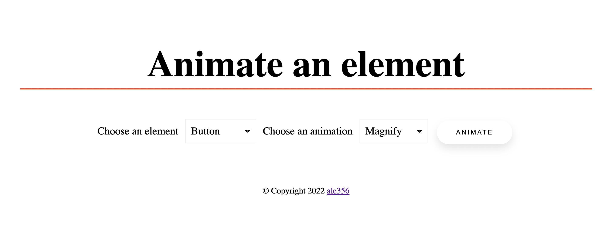

# Stand-outify Demo App
## Description
Demo web application to showcase the functionality of the library Stand-outify.

## Get the Stand-outify library from this link
https://github.com/ale356/stand-outify
## Installation
Fork this repository.
```
$ git clone https://github.com/ale356/stand-outify-demo-app.git
```
Then open the folder with your favorite IDE.

Then install all the depenencies with npm.
```
$ npm i
```
Then run the program in the terminal with the command.
```
$ npm run dev
```
Then click on the local host link in the terminal to open the app in the browser.
##### Example:
```
$ Local: http://localhost:5182/
```

## Test Report
| Use-Cases     | Manual Test-Cases | Test Results |
| ------------- | ------------- | -------- |
| [UC1](https://github.com/ale356/stand-outify-demo-app/blob/main/resources/Use-Cases.md#uc1-showcase-an-animated-element)           | [TC1.1](https://github.com/ale356/stand-outify-demo-app/blob/main/resources/Test-Cases.md#tc11-showcase-an-animated-button-element-successfully)         | OK       |
| [UC1](https://github.com/ale356/stand-outify-demo-app/blob/main/resources/Use-Cases.md#uc1-showcase-an-animated-element)           | [TC1.2](https://github.com/ale356/stand-outify-demo-app/blob/main/resources/Test-Cases.md#tc12-showcase-an-animated-h1-element-successfully)         | OK       |

## License
   Copyright 2022 ale356

   Licensed under the Apache License, Version 2.0 (the "License");
   you may not use this file except in compliance with the License.
   You may obtain a copy of the License at

       http://www.apache.org/licenses/LICENSE-2.0

   Unless required by applicable law or agreed to in writing, software
   distributed under the License is distributed on an "AS IS" BASIS,
   WITHOUT WARRANTIES OR CONDITIONS OF ANY KIND, either express or implied.
   See the License for the specific language governing permissions and
   limitations under the License.
