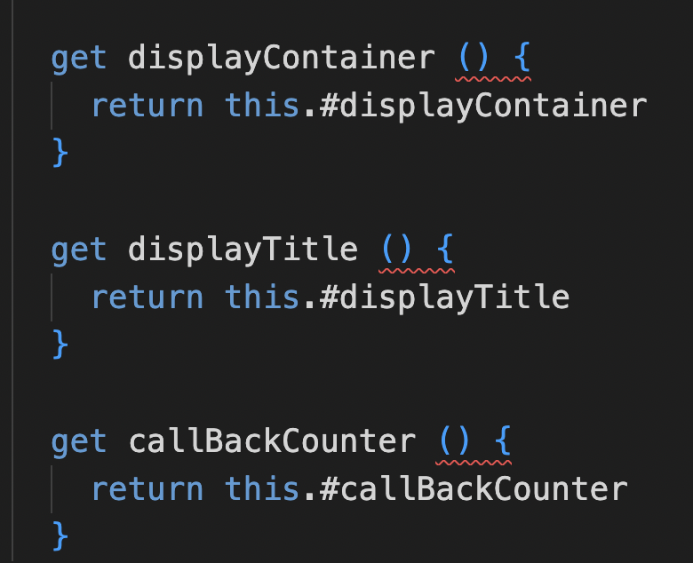
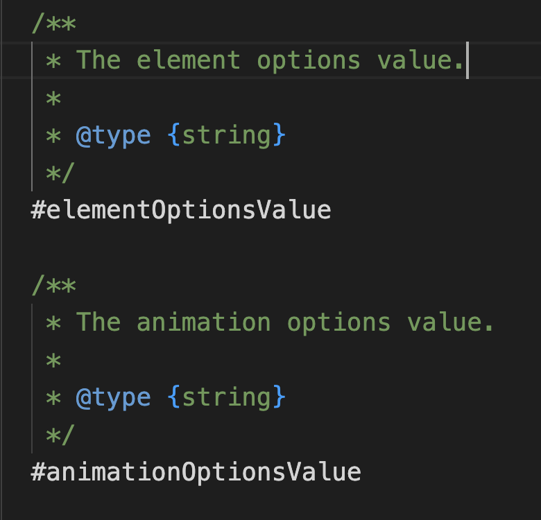
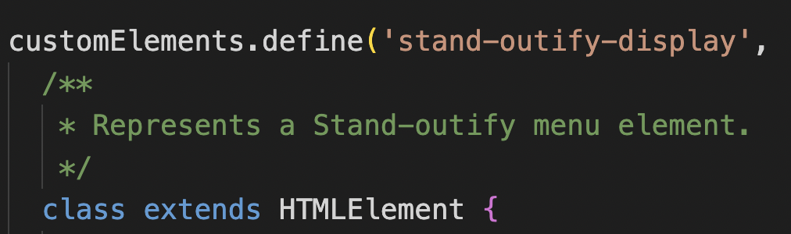
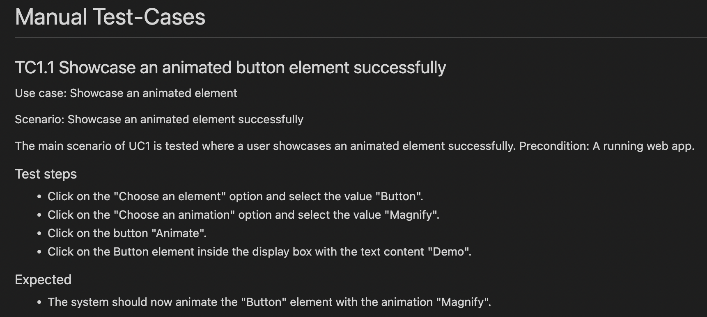

# Reflection
This is a reflection on the chapters 2 - 11 in the book Clean Code.
## Chapter 2
This is the chapter that I think has affected me the most. Since naming is something we do very frequently as programmers for functions, variables, parameters, classes and packages. The rules in this chapter has been helpful such as "Use Intention-Revealing Names" and "Use Pronounceable Names". You can see that in the method name "changeAnimationStyle" in stand-outify that I have only choosed words to make it easier to pronounce. It is also quite clear what the method will do thanks to it's method name. I choose to have a comment for the method since I wanted to tell the type of the parameter.
")
## Chapter 3
This chapter and the rule "Small!" caused me to reevaluate the amount of code I had inside my functions and methods. It also made me think about lifting out code inside methods/functions to make smaller methods/functions which helped with the overall code readability. I turned the method initializeStandOutify() in stand-outify which were at first 21 lines long of code into 4 lines of code.
")
In the method changeColorOfAnimation() in stand-outify I have several lines of code inside an if statement, this breaks the rule of "Blocks and Indenting". They mention that the line inside the if statement should be a function call and I could have probaly turned the lines of code into a method called "updateColorOfAnimation()".
")
## Chapter 4
This chapter really emphasized the importance of "the code". That the truth can only be found in the code itself not the comments. Once I started implementing more rules from the book I saw that a lot of my comments were unnecesary since my code told the reader what it does. Often times I was just repeating myself. I find myself cleaning up my code and removing a lot of comments after reading this chapter. In the setter method "setEventType()" I use the rule "Explain Yourself in Code" in the if statements condition. Instead of just plain code I turned it into a function to make it easier to understand.
")
## Chapter 5
This chapter taught me that coding style and readability will survive longer than the code that has been implemented. Since code have a tendency to change with new releases. The stand-outify class is roughly 320 lines of code which is my biggest file. This means that my classes are within the range of 200 - 500 lines of code, that is considered used to build significant systems with. One rule that I have followed from this chapter is "Vertical Openness Between Concepts", to improve the visual readability and separate different concepts from each other. The rule is applied on the getters in the component stand-outify-display.

## Chapter 6
This chapter taught me that objects are ideal for hiding data behind abstractions with the help of functions that work on that data. While data structures expose their data and have no impactful functionality. Data structures are useful for example when communicating with databases they are then often called "DTO" which stands for data transfer object. If you look at the class stand-outify-menu you can see that it's a object since I hide the data and expose some of the behaviour in this case the getters.

## Chapter 7
This chapter taught me how useful exceptions is for separating the main logic from the error handling. This helps with better understanding both of these areas independently. One rule that I followed from this chapter was "Provide Context with Exceptions". This will help any future programmers using this application by providing context of the error and where it came from. As you can see on this example I let the user know that they have inputed the wrong data type.
.")
## Chapter 8
This chapter taught me that boundaries are important when using third-party libraries. Because of the need to protect your own code and not let it be to dependant on something you can't control, in this case the third-party code. We can do this by having few places in the code that refer to the third-party boundaries. Our own code speaks to us better and has fewer maintenance points when the third-party code changes. I didn't use any third-party code in this project but I did create boundaries between my code. I made web components/classes to isolate and create boundaries between different parts of the code.

## Chapter 9
The main take away from this chapter is for me that "Test code is just as important as production code.". I think that this implies that the test code are just as important to a projects health as the production code is. But test code is not enough, there needs to be clean tests. That can be achieved by following the F.I.R.S.T rules where each of the five rules emphasizes one important thing to follow. I have just written two manual test cases for this project since the user interface is quite simple. But the things mentioned in this chapter will be of great use for future projects.
